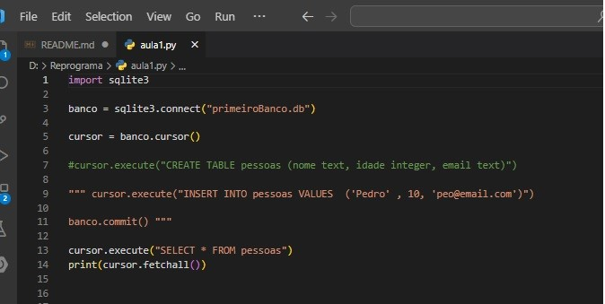

<h1 align="center">
  
</h1>

# Banco de Dados 🎲

Turma Online 26 |Python | Semana 10 | 2023 | Professora Edilene Lopes

### Instruções
Antes de começar, vamos organizar nosso setup.
* Fork esse repositório 
* Clone o fork na sua máquina (Para isso basta abrir o seu terminal e digitar `git clone url-do-seu-repositorio-forkado`)
* Entre na pasta do seu repositório (Para isso basta abrir o seu terminal e digitar `cd nome-do-seu-repositorio-forkado`)
* [Add outras intrucoes caso necessario]

### Resumo
O que veremos na aula de hoje?
* [Banco de dados](#tema1)
* [Conectando com Python](#tema2)
* [Migrar um arquivo via Sqlite](#tema3)

## Conteúdo
### Tema1 
1. [O que é banco de dados](#tema1)
2. [Sql NoSql](#topico2)
3. [Tabelas](#topico3)
4. [Chave Primária](#topico4)
5. [Comandos Sql](#topico5)

### Tema2 
2. [Conectando o banco de dados com Python](#tema2)
   * [Manipulando o banco via python](#subtopico)
  
   
### Tema3
3. [Migrar um arquivo csv](#topico1)

### Banco de dados 

#### O que é um banco de dados

É um conjunto de informações que são organizadas em uma estrutura específica para permitir seu armazenamento e recuperação de maneira eficiente. Ele pode ser utilizado em diversos tipos de sistemas, desde aplicações simples até sistemas complexos de grande porte.
Os primeiros fundamentos de banco de dados relacionais surgiram entre as décadas de 1960 a 1970 pela IBM. Na década de 80, a Oracle, com a permissão da IBM, foi a primeira empresa a desenvolver o banco utilizando o padrão SQL para consulta/escrita como é  conhecido hoje. 
Após a explosão da web, também conhecida como web 2.0, foi necessário uma alternativa  ao SQL(relacional), assim, a partir de 1998, foi criado o conceito de banco nosql( não relacional ).

 #### Conectando com Python
- import sqlite3
- conn = sqlite3.connect('meu_banco_de_dados.db')

### Tabelas e tipos de dados
#### Comandos SQL
* [Tipos de comandos](#subtopico1)
* [Alguns comandos Sql](#Subtopico2)

##### Tipos de comandos Sql
DDL, DQL, DML, DCL e TCL.

##### Alguns comnandos Sql
- SELECT

- UPDATE

- DELETE

- INSERT

- WHERE

### Conexão com Python
#### Alguns métodos Python
- cursor = conn.cursor()
- cursor.execute()
- conn.commit()
- conn.close()

***
### Exercícios 
* [Exercicio para sala](https://github.com/mflilian/repo-example/tree/main/exercicios/para-sala)
* [Exercicio para casa](https://github.com/mflilian/repo-example/tree/main/exercicios/para-casa)

### Material da aula 

### Links Úteis
- [Banco de dados teoria](https://www.oracle.com/br/database/what-is-database/)
- [Banco de dados teoria](https://rockcontent.com/br/blog/banco-de-dados/)
- [Sqlite online](https://sqliteonline.com/)
- [Visualizar sqlite no vscode](https://www.youtube.com/watch?v=bzxZsRPpFQs)
- [Plataforma Kaggle](https://www.kaggle.com/)

Desenvolvido com :purple_heart:  

